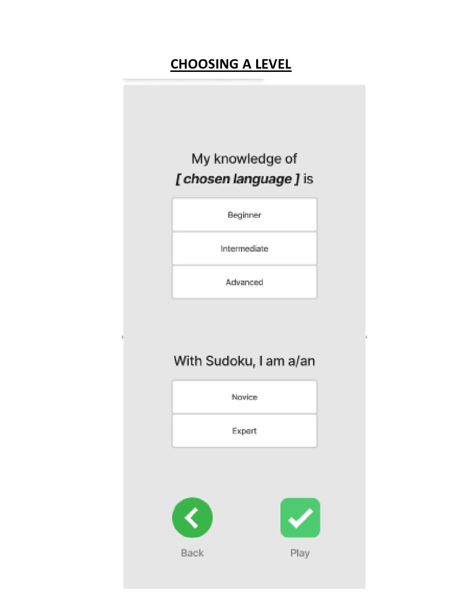

As a

1.  # Novice users of the software

	GENERAL USER INTERFACE ACCESSIBILITY REQUIREMENTS

	1. I want the game’s interface to be easy to understand so I can start playing quickly. 
    **Examples:**
		-   Whatever action the user wants to do, he/she can figure out the appropriate button or sequence of buttons in under 2 seconds.
			-   This is achieved through all the requirements expressed below *(from 1b onwards)*
	    -   Every time the app launches, it should take no more than 3 taps before the player can start playing the game.
     

	INSTRUCTIONAL TUTORIAL

	2.  I want to have a simple onboarding tutorial so that I can learn the basic rules of the game. 
    **Examples:**
		-   When the app launches for the first time, the player is greeted with a video-tutorial explaining how to play the game.
		-   The homepage should have a button or section that takes the player to the tutorial.
	    -   If the players start playing the game without ever seeing the tutorial, there should be more mistakes made on average than if they had seen the tutorial.
     

	PAUSE and RESUME FUNCTIONALITY

	3.  I want the game to be saved automatically and to be able to pause it so that if I need to do something else, I can come back later and resume it. 
	**Examples:**
		-   When the “Pause” button is tapped, the game’s clock is paused and the cells and words do not respond to taps.
			-   When the “Resume” button is tapped, the game’s clock resumes, the game responds like before, and the board remains the same.
		- When the player exits the app or taps the “Home” or “Settings” button, and then resumes the game, the game looks exactly as if it had been paused before the first action was performed.
		*(game will be auto-saved)*
 

	CHECKING FOR GAME CORRECTNESS

	4.  I want feedback as to whether a move I make is right or wrong so that I can learn as I play. 
	**Examples:**
		-   Given a cell selected by the player,
			- When it is filled in a way not in accordance with the rules of the game, that cell will be highlighted with a different colour than when it’s correct or empty.
			- When it’s filled correctly, that cell’s colour will be the same as when it’s empty.
		- When a row/column/subgrid is completed correctly, it will be quickly highlighted with a different colour before changing back to its original colour.
		- When the game play is completed correctly, the player will be directed to a page where it congratulates the player on finishing that game along with some statistics such as the time spent and the levels of Sudoku and language used.
     

	UNDO and REDO FUNCTIONALITY

	5.  I want to be able to undo and redo my moves so that I can fix my mistakes or try out a new strategy. 
	**Examples:**
		-   Given a cell the player just filled in,
			- When the player taps the “Undo” button, that cell will appear as it was prior to being filled in
			- When the player taps the “Redo” button, nothing happens.
	    -   Given an initial board with no moves made yet,
			-   When the “Undo” button is tapped, nothing happens.
			- When the “Redo” button is tapped, nothing happens.
		- Given a cell that was “undone”,
			- When the “Undo” button is tapped, that cell will appear as it was two moves prior to being “undone”.
			- When the “Redo” button is tapped, that cell will appear as it was before it was “undone”.
		 -   Given a cell that was “redone”,
			 - When the “Undo” button is tapped, that cell will look like before it was “redone”.
			 - When the “Redo” button is tapped, that cell will appear as it was two moves prior to being “redone”.
    
	GAME HINTS

	6.  I want to have a hint every now and then so that I don’t get stuck and may learn something new. 
	**Examples:**
		-   When the “Hint” button is tapped, a cell that is currently empty or incorrect will be filled in a way that is in accordance with the rules of the game.
		- The player has to wait 30 seconds from the last time a hint was used before getting another one.
    
	SCORING SYSTEM

	7.  I want to have a (scoring) system so that I can see how well I’m doing compared with my past plays or with others. 
	**Examples:**
		-   Every time a game is completed correctly, its total time duration is recorded along with how many mistakes were made and other metadata.
		- While on a certain difficulty level, the user will receive the “highscore” notification every time they beat their previous high score in that level using their selected language.
			- Highscore is calculated as the amount of time it takes the user to complete the sudoku
	 

2.  # Expert users 
	*Defined as users who are already good at Sudoku.*

	CHALLENGES *(for players)*

	1.  I want the game to have multiple levels of difficulty so that I can challenge myself. 
	**Examples:**
		-   When choosing the level of the game, the player can choose between a “Novice” or an “Expert” level.
		-   Harder levels have fewer cells prefilled than easier ones.
    
	

	TAKING NOTES DURING THE GAME

	2.  I want to take notes on a specific cell so that I can remember what answers are possible for that one. 
	**Examples:**
		-   Given the player taps the “Notes” button and selects a fillable cell,
			- No error checking is done in this mode.
			- When a word is tapped, a tiny version of it will be displayed in that cell.
				- When that word is tapped again, it will be removed from that cell.
			- When the player taps the “Notes” button again, the game is no longer in the note-taking mode.
    
		-   Given the player selects a cell while not in the note-taking mode,
			- Error checking functions as normal.
			- When a word is tapped, all the notes in that cell will be erased and replaced with that word.
				- If that word also appears in other cells’ notes of the same row/column/subgrid, the tiny versions of this word in those cells will be removed.
    
	PAST GAMES

	3.  I want to see how I played my past games, including game configurations, moves made, time spent for each move, etc., so that I can analyze my past strategies and improve them. 
	**Examples:**
		-   When the “History” button is tapped on the homepage, the user is directed to a page with a sortable list of games played from each level, each showing some or all of the above information.
			- When the user taps a specific game, another page is shown with more details such as the lists of words used and game configurations.
			*(User’s previous games+stats have been auto-saved)*
	 

3.  # Language learners
    *The 3 levels roughly correspond to A1/A2, B1/B2, and C1/C2 of [CEFR: Common European Framework of Reference for Languages](https://www.coe.int/en/web/common-european-framework-reference-languages/level-descriptions).*

	COMMON REQUIREMENTS FOR LANGUAGE LEARNERS

	-   I want to see the list of words used in my past games so that I can review and study them. 
    **Examples:** *(similar to 2.c.)*

	-   I want to save the words I like in a game so that I can quickly review them later to study. 
    **Examples:**
		-   During a game play, the player can select a word and add it to a list of favourite words.
		- On the homepage, when the user taps the “Saved” button, a page will be shown with a sortable list of words saved along with which languages they are in.
    

	WORD TRANSLATION
	-   I want to look up the meaning of the words I don’t know so that I can learn what they are and solve the game faster. 
   **Examples:**
		-   During a game play, when the player taps-and-holds a word, a pop-up will open with a translation of that word in the language that the player knows.
    
	1.  ## Level 1
	    LANGUAGE DIFFICULTY LEVEL (A1/A2)
		
		- I want the game to use words that match my level of the language being studied (up to A2) so that I’m not overwhelmed by what I don’t know. 
			**Examples:**
			-   If the player’s native language is English and is studying French, the following sample of words and their French counterparts may be used: December, twelve, thank you, sorry, goodbye …
	 
    
    2.  ## Level 2
	    LANGUAGE DIFFICULTY LEVEL (B1/B2)

		- I want the game to use words that match my level of the language being studied (B1/B2) so that I’m not overwhelmed by what I don’t know and not bored by what I already know. 
			**Examples:**
			-   If the player’s native language is English and is studying French, the following sample of words and their French counterparts may be used: although, now, second, disagree, application, …
	 
    
	3.  ## Level 3
	    LANGUAGE DIFFICULTY LEVEL (C1/C2)
		
		- I want the game to use words that match my level of the language being studied (C1/C2) so that I’m not bored by what I already know. 
			**Examples:**
			-   If the player’s native language is English and is studying French, the following sample of words and their French counterparts may be used: contract, narrative, offspring, elapse, diarrhea, …
	 
    
4.  # Language teachers
    LANGUAGE TEACHER’S GOAL

	1.  I want the game to be easy to understand and interactive so it is more appealing and my students are more willing to try it out and use it as a fun tool for everyday learning. *(similar to 1a.)* 
	**Examples:**
		-   When the players need help, there are a tutorial *(1b.)* and a hint system *(1f.)* readily available.
	    -   When the students work hard, they are rewarded for their effort *(4b)*
	    -   Ensure that the app design is intuitive and engaging

	REWARD TO KEEP STUDENTS/USERS MOTIVATED

	2.  I want my students to be rewarded for their effort so that they stay motivated. 
    **Examples:**
	    -   When the user plays the game for several days in a row, a page will pop up congratulating them for their effort.
    
	CUSTOMIZE WORD-LISTS
	
	3.  I want to curate my own lists of word pairs for use with the game so that the words they learn fit into the current themes or topics I’m teaching. 
    **Examples:**
	    -   When the user taps the “Settings” button followed by “Curate my own word lists” option, the users are directed to a page where they can input their own word lists by uploading a specially formatted file.
		    -   Once set up, every game that matches the provided language configurations would use those words and those only.
