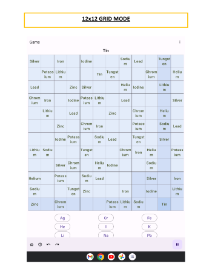

**Table of content**

[[_TOC_]]

---

# 1. NOVICE USERS OF THE SOFTWARE

## General User Interface Accessibility Requirements

### 1.1. I want the game’s interface to be easy to understand so I can start playing quickly. {- [ NOT Implemented ] -}

**Examples:**

- Whatever action the user wants to do, he/she can figure out the appropriate button or sequence of
  buttons in under 2 seconds.
  - This is achieved through all the requirements expressed below *(from [1.2.][] onwards)*.
- Every time the app launches, it should take no more than 3 taps before the player can start
  playing the game.

## Instructional Tutorial

### 1.2. I want to have a simple onboarding tutorial so that I can learn the basic rules of the game. {- [ NOT Implemented ] -}

**Examples:**

- When the app launches for the first time, the player is greeted with a video-tutorial explaining
  how to play the game.
- The homepage should have a button or section that takes the player to the tutorial.
- If the players start playing the game without ever seeing the tutorial, there should be more
  mistakes made on average than if they had seen the tutorial.

## Pause and Resume Functionality

### 1.3. I want the game to be saved automatically and to be able to pause it so that if I need to do something else, I can come back later and resume it. {- [ NOT Implemented ] -}

**Examples:**

- When the “Pause” button is tapped, the game’s clock is paused and the cells and words do not
  respond to taps.
    - When the “Resume” button is tapped, the game’s clock resumes, the game responds like before,
      and the board remains the same.
- When the player exits the app or taps the “Home” or “Settings” button, and then resumes the game,
  the game looks exactly as if it had been paused before the first action was performed. *(game will
  be auto-saved)*

## Checking For Game Correctness

### 1.4. I want feedback as to whether a move I make is right or wrong so that I can learn as I play. {+ [ IMPLEMENTED ] +}

**Examples:**

- Given a cell selected by the player,
  - Its row/column/subgrid will be highlighted with a different colour than when it's not
    selected. {+ [ IMPLEMENTED ] +}
  - When it's filled in a way not in accordance with the rules of the game, that cell will be
    highlighted with a different colour than when it’s correct or empty. {+ [ IMPLEMENTED ] +}
  - When it’s filled correctly, that cell’s colour will be the same as when it’s
    empty. {+ [ IMPLEMENTED ] +}
- When the game play is completed correctly,
    - The word buttons will be disabled and the contents of the cells will become
      read-only. {+ [ IMPLEMENTED ] +}
    - The player will be directed to a page where
      - It congratulates the player on finishing that game {+ [ IMPLEMENTED ] +}
      - Along with some statistics such as the time spent and the levels of Sudoku and language
        used. {- [ NOT Implemented ] -}

## Erase Cell Content Functionality

### 1.5. I want to clear the content of a cell I select so that I can input a new value to correct my mistake if there’s any. {+ [ IMPLEMENTED ] +}

**Examples:**

- Given a selected cell that’s prefilled, when the “Erase” button is tapped, nothing
  happens. {+ [ IMPLEMENTED ] +}
- Given a selected cell that’s non-empty and is user fillable, when the “Erase” button is tapped,
  that cell becomes empty. {+ [ IMPLEMENTED ] +}
- Given a selected cell that’s empty, when the “Erase” button is tapped, that cell remains
  empty. {+ [ IMPLEMENTED ] +}

## Quick Cell View Functionality

### 1.6. I want to see the full text of a cell displayed somewhere convenient when it’s too long to fit inside that cell. {+ [ IMPLEMENTED ] +}

**Examples:**

- When a non-empty cell is tapped, its full content will be displayed in the “Quick view
  area”. {+ [ IMPLEMENTED ] +}
- When an empty cell or the app background is tapped, nothing will appear in the “Quick view
  area”. {+ [ IMPLEMENTED ] +}
- When a word button is tapped, its content will be displayed in the “Quick view
  area”. {+ [ IMPLEMENTED ] +}

## Undo and Redo Functionality

### 1.7. I want to undo and redo my moves so that I can fix my mistakes or try out a new strategy. {- [ NOT Implemented ] -}

**Examples:**

- Given a cell the player just filled in,
    - When the player taps the “Undo” button, that cell will appear as it was prior to being filled
      in.
    - When the player taps the “Redo” button, nothing happens.
- Given an initial board with no moves made yet,
    - When the “Undo” button is tapped, nothing happens.
    - When the “Redo” button is tapped, nothing happens.
- Given a cell that was “undone”,
    - When the “Undo” button is tapped, that cell will appear as it was two moves prior to being
      “undone”.
    - When the “Redo” button is tapped, that cell will appear as it was before it was “undone”.
- Given a cell that was “redone”,
    - When the “Undo” button is tapped, that cell will look like before it was “redone”.
    - When the “Redo” button is tapped, that cell will appear as it was two moves prior to being
      “redone”.

## Game Hints

### 1.8. I want to have a hint every now and then so that I don’t get stuck and may learn something new. {- [ NOT Implemented ] -}

**Examples:**

- When the “Hint” button is tapped, a cell that is currently empty or incorrect will be filled in a
  way that is in accordance with the rules of the game.
- The player has to wait 30 seconds from the last time a hint was used before getting another one.

## Scoring System

### 1.9. I want to have a (scoring) system so that I can see how well I’m doing compared with my past plays or with others. {- [ NOT Implemented ] -}

**Examples:**

- Every time a game is completed correctly, its total time duration is recorded along with how many
  mistakes were made and other metadata.
- While on a certain difficulty level, the user will receive the “highscore” notification every time
  they beat their previous high score in that level using their selected language.
    - Highscore is based on how fast the user completes the sudoku game.

# 2. EXPERT USERS

*Defined as users who are already good at Sudoku.*

## Challenges *(for players)*

### 2.1. I want the game to have multiple levels of difficulty so that I can challenge myself. {- [ NOT Implemented ] -}

**Examples:**

- When choosing the level of the game, the player can choose between a “Novice” or an “Expert”
  level.
- Harder levels have fewer cells prefilled than easier ones.

## Taking Notes During The Game

### 2.2. I want to take notes on a specific cell so that I can remember what answers are possible for that one. {- [ NOT Implemented ] -}

**Examples:**

- Given the player taps the “Notes” button and selects a fillable cell,
    - No error checking is done in this mode.
    - When a word is tapped, a tiny version of it will be displayed in that cell.
        - When that word is tapped again, it will be removed from that cell.
    - When the player taps the “Notes” button again, the game is no longer in the note-taking mode.
- Given the player selects a cell while not in the note-taking mode,
    - Error checking functions as normal.
    - When a word is tapped, all the notes in that cell will be erased and replaced with that word.
        - If that word also appears in other cells’ notes of the same row/column/subgrid, the tiny
          versions of this word in those cells will be removed.

## Past Games

### 2.3. I want to see how I played my past games, including game configurations, moves made, time spent for each move, etc, so that I can analyze my past strategies and improve them. {- [ NOT Implemented ] -}

**Examples:**

- When the “History” button is tapped on the homepage, the user is directed to a page with a
  sortable list of games played from each level, each showing some or all of the above information.
    - When the user taps a specific game, another page is shown with more details such as the lists
      of words used and game configurations.  *(User’s previous games+stats have been auto-saved)*

# 3. LANGUAGE LEARNERS

*The 3 levels roughly correspond to A1/A2, B1/B2, and C1/C2
of [CEFR: Common European Framework of Reference for Languages](https://www.coe.int/en/web/common-european-framework-reference-languages/level-descriptions).*

## Common Requirements For Language Learners

- I want to see the list of words used in my past games so that I can review and study
  them. {- [ NOT Implemented ] -}

  **Examples:** *(similar to [2.3.][])*

- I want to save the words I like in a game so that I can quickly review them later to
  study. {- [ NOT Implemented ] -}

  **Examples:**

  - During a game play, the player can select a word and add it to a list of favourite words.
  - On the homepage, when the user taps the “Saved” button, a page will be shown with a sortable
    list of words saved along with which languages they are in.

## Word Translation

- I want to look up the meaning of the words I don’t know so that I can learn what they are and
  solve the game faster. {- [ NOT Implemented ] -}

  **Examples:**

  - During a game play, when the player taps-and-holds a word, a pop-up will open with a translation
    of that word in the language that the player knows.

### 3.1. Level 1

- I want the game to use words that match my level of the language being studied (up to A2) so that
  I’m not overwhelmed by what I don’t know. {- [ NOT Implemented ] -}

  **Examples:**

  - If the player’s native language is English and is studying French, the following sample of words
    and their French counterparts may be used:
    > December, twelve, thank you, sorry, goodbye …

### 3.2. Level 2

- I want the game to use words that match my level of the language being studied (B1/B2) so that
  I’m not overwhelmed by what I don’t know and not bored by what I already
  know. {- [ NOT Implemented ] -}

  **Examples:**

  - If the player’s native language is English and is studying French, the following sample of words
    and their French counterparts may be used:
    > although, now, second, disagree, application, …

### 3.3. Level 3

- I want the game to use words that match my level of the language being studied (C1/C2) so that I’m
  not bored by what I already know. {- [ NOT Implemented ] -}

  **Examples:**

  - If the player’s native language is English and is studying French, the following sample of words
    and their French counterparts may be used:
    > contract, narrative, offspring, elapse, diarrhea, …

# 4. LANGUAGE TEACHERS

## Language Teacher's Goals

### 4.1. I want the game to be easy to understand and interactive so it is more appealing and my students are more willing to try it out and use it as a fun tool for everyday learning. {- [ NOT Implemented ] -}

*(similar to [1.1.][])*

**Examples:**

- When the players need help, there is a tutorial *([1.2.][])* and a hint system *([1.8.][])*
  available.
- When the students work hard, they are rewarded for their effort *([4.2.][])*.
- Ensure that the app design is intuitive and engaging.

## Reward To Keep Students/Users Motivated

### 4.2. I want my students to be rewarded for their effort so that they stay motivated. {- [ NOT Implemented ] -}

**Examples:**

- When the user plays the game for several days in a row, a page will pop up congratulating them for
  their effort.

## Customize Word-lists

### 4.3. I want to curate my own lists of word pairs for use with the game so that the words they learn fit into the current themes or topics I’m teaching. {- [ NOT Implemented ] -}

**Examples:**

- When the user taps the “Settings” button followed by “Curate my own word lists” option, the users
  are directed to a page where they can input their own word lists by uploading a specially
  formatted file.
    - Once set up, every game that matches the provided language configurations would use those
      words and those only.

# 5. NEW REQUIREMENTS FOR ITERATIONS 2 AND 3

## Different Devices

### 5.1. As a vocabulary learner practicing at home, I want to use my tablet for Sudoku vocabulary practice, so that the words will be conveniently displayed in larger, easier to read fonts. {+ [ IMPLEMENTED ] +}

**Examples:**

- When the app is launched on the tablet, the words will be displayed in a larger size fonts
  than when it’s displayed on a phone. {+ [ IMPLEMENTED ] +}
- Tablet users, on average, should not have to squint their eyes to read the contents compared
  to users of smaller devices. {- [ N/A ] -}

### 5.2. As a vocabulary learner taking the bus, I want to use my phone in landscape mode for Sudoku vocabulary practice, so that longer words are displayed in a larger font than standard mode. {+ [ IMPLEMENTED ] +}

**Examples:**

- When the app is in landscape mode, longer words are displayed in larger size fonts than in
  standard portrait mode. {+ [ IMPLEMENTED ] +}
  - This is made possible with the quick cell view functionality *([1.6.][])*.
- Users using landscape mode should not have to squint their eyes, on average, to read the contents
  compared to users in portrait mode. {- [ N/A ] -}
- When a device is rotated, the contents and states of the game should remain the same as before
  it’s rotated. {+ [ IMPLEMENTED ] +}

## Different Size Sudoku Grids

### 5.3. As a teacher of elementary and junior high school children, I want scaled versions of Sudoku that use 4x4 and 6x6 grids. In the 6x6 grid version, the overall grid should be divided into rectangles of six cells each (2x3). {+ [ IMPLEMENTED ] +}

**Examples:**

- When the game is in 4x4 grid mode,
  - Each column should have 4 cells. {+ [ IMPLEMENTED ] +}
  - Each row should have 4 cells. {+ [ IMPLEMENTED ] +}
  - The total number of cells should be 16 with no sub-grids. {+ [ IMPLEMENTED ] +}
  - A valid game should have no repeating values in each column or row of the
    board. {+ [ IMPLEMENTED ] +}
- When the game is in 6x6 grid mode,
  - Each column should have 6 cells. {+ [ IMPLEMENTED ] +}
  - Each row should have 6 cells. {+ [ IMPLEMENTED ] +}
  - The total number of cells should be 36 with each 2x3 sub-grid having 6 cells in
    total. {+ [ IMPLEMENTED ] +}
  - Each column of the sub-grids should have 2 cells. {+ [ IMPLEMENTED ] +}
  - Each row of the sub-grids should have 3 cells. {+ [ IMPLEMENTED ] +}
  - A valid game should have no repeating values in each column, row, or sub-grid of the
    board. {+ [ IMPLEMENTED ] +}

### 5.4. As a vocabulary learner who wants an extra challenging mode, I want a 12x12 version of Sudoku to play on my tablet. The overall grid should be divided into rectangles of 12 cells each (3x4). {+ [ IMPLEMENTED ] +}

**Examples:**

- When the game is in 12x12 grid mode,
  - Each column should have 12 cells. {+ [ IMPLEMENTED ] +}
  - Each row should have 12 cells. {+ [ IMPLEMENTED ] +}
  - The total number of cells should be 144 with each 3x4 sub-grid having 12 cells in
    total. {+ [ IMPLEMENTED ] +}
  - Each column of the sub-grids should have 3 cells. {+ [ IMPLEMENTED ] +}
  - Each row of the sub-grids should have 4 cells. {+ [ IMPLEMENTED ] +}
  - A valid game should have no repeating values in each column, row, or sub-grid of the
    board. {+ [ IMPLEMENTED ] +}
- When the app is launched on a tablet, the words will be displayed in a larger size fonts than when
  it’s displayed on a phone. {+ [ IMPLEMENTED ] +}
- These users should, on average, not have to squint their eyes to read the contents compared to
  users of smaller devices, but may have more difficulty reading compared to tablet users playing
  with smaller grid sizes. {- [ N/A ] -}

# 6. NEW REQUIREMENTS FOR ITERATIONS 4

### 6.1. As a student who wants to practice my understanding of spoken words in the languages that I am learning, I want a listening comprehension mode. 

**Examples:**
- In this mode, numbers will appear in the prefilled cells. 
- When I press the number, the corresponding word in the language that I am learning will be read out to me.
- I can then test my listening comprehension by selecting from the menu the correct English (or my native languge) translation of the word.

# VISUAL STATES OF THE GAME/APPLICATION

 
 
 
 
 
 
 
 
 
 
 

[//]: <> (References to the header IDs below should be extracted from the TOC as rendered on GitLab.)

[1.1.]: #general-user-interface-accessibility-requirements

[1.2.]: #instructional-tutorial

[1.6.]: #quick-cell-view-functionality

[1.8.]: #game-hints

[2.3.]: #past-games

[4.2.]: #reward-to-keep-studentsusers-motivated
