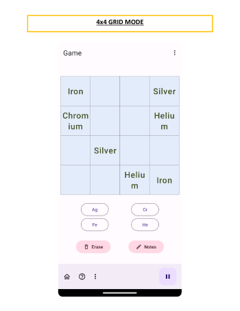
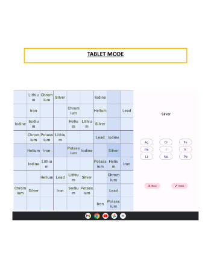
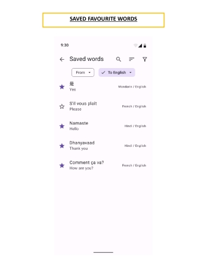

**Table of content**

[[_TOC_]]

---

# 1. NOVICE USERS OF THE SOFTWARE

## Pause and Resume Functionality

### 1.1. I want the game to be saved automatically and to be able to pause it so that if I need to do something else, I can come back later and resume it. 

**Examples:**

- When the “Pause” button is tapped, the game’s clock is paused and the cells and words do not
  respond to taps. 
    - When the “Resume” button is tapped, the game’s clock resumes, the game responds like before,
      and the board remains the same. 
- When the player exits the app or taps the “Home” or “Settings” button, and then resumes the game,
  the game looks exactly as if it had been paused before the first action was performed. *(game will
  be auto-saved)* 

## Checking For Game Correctness

### 1.2. I want feedback as to whether a move I make is right or wrong so that I can learn as I play. 

**Examples:**

- Given a cell selected by the player,
    - Its row/column/subgrid will be highlighted with a different colour than when it's not
      selected. 
    - When it's filled in a way not in accordance with the rules of the game, that cell will be
      highlighted with a different colour than when it’s correct or empty. 
    - When it’s filled correctly, that cell’s colour will be the same as when it’s
      empty. 
- When the game play is completed correctly,
    - The word buttons will be disabled and the contents of the cells will become
      read-only. 
    - The player will be directed to a page where
        - It congratulates the player on finishing that game 
    

## Erase Cell Content Functionality

### 1.3. I want to clear the content of a cell I select so that I can input a new value to correct my mistake if there’s any. 

**Examples:**

- Given a selected cell that’s prefilled, when the “Erase” button is tapped, nothing
  happens. 
- Given a selected cell that’s non-empty and is user fillable, when the “Erase” button is tapped,
  that cell becomes empty. 
- Given a selected cell that’s empty, when the “Erase” button is tapped, that cell remains
  empty. 

## Quick Cell View Functionality

### 1.4. I want to see the full text of a cell displayed somewhere convenient when it’s too long to fit inside that cell. 

**Examples:**

- When a non-empty cell is tapped, its full content will be displayed in the “Quick view
  area”. 
- When an empty cell or the app background is tapped, nothing will appear in the “Quick view
  area”. 
- When a word button is tapped, its content will be displayed in the “Quick view
  area”. 

## Reset Game Functionality

### 1.5. I want to reset the current game so that I can start over quickly without having to erase every cell. 

**Examples:**

- Given a partially filled board, when the "Reset" button is tapped,
  - The board's values will be back to what they were when the current game
    started. 
  - The word buttons will remain the same. 
  - Nothing will appear in the “Quick view area”. 

## Start New Game Functionality

### 1.6. I want to have a dedicated button for starting a new game so I don't have to go through the homepages again to achieve that. 

**Examples:**

- Given a game currently in progress, when the "New game" button is tapped,
  - The dimension of the board, number of word buttons, languages, and levels settings remain the
    same. 
  - The board's values will be replaced with a new set of prefilled values. 
    - All of the user fillable cells will be cleared. 
  - The word buttons will be replaced with a new set of values. 
  - Nothing will appear in the “Quick view area”. 

# 2. EXPERT USERS

*Defined as users who are already good at Sudoku.*

## Challenges *(for players)*

### 2.1. I want the game to have multiple levels of difficulty so that I can challenge myself. 

**Examples:**

- When choosing the level of the game, the player can choose between a “Novice” or an “Expert”
  level. 
- Harder levels have fewer cells prefilled than easier ones. 

### 2.2. As an expert user who wants an extra challenging mode, I want a 12x12 version of Sudoku to play on my tablet. The overall grid should be divided into rectangles of 12 cells each (3x4). 

**Examples:**

- When the game is in 12x12 grid mode,
  - Each column should have 12 cells. 
  - Each row should have 12 cells. 
  - The total number of cells should be 144 with each 3x4 sub-grid having 12 cells in
    total. 
  - Each column of the sub-grids should have 3 cells. 
  - Each row of the sub-grids should have 4 cells. 
  - A valid game should have no repeating values in each column, row, or sub-grid of the
    board. 
- When the app is launched on a tablet, the words will be displayed in a larger size fonts than when
  it’s displayed on a phone. 
- These users should, on average, not have to squint their eyes to read the contents compared to
  users of smaller devices, but may have more difficulty reading compared to tablet users playing
  with smaller grid sizes. 

# 3. LANGUAGE LEARNERS

*The 3 levels roughly correspond to A1/A2, B1/B2, and C1/C2
of [CEFR: Common European Framework of Reference for Languages](https://www.coe.int/en/web/common-european-framework-reference-languages/level-descriptions).*

### 3.1. As a student who wants to practice my understanding of spoken words in the languages that I am learning, I want a listening comprehension mode. 

**Examples:**

- In this mode, numbers will appear in the prefilled cells. 
- When I press the number, the corresponding word in the language that I am learning will be read
  out to me. 
- When I press a word button, the word will be read out to me in my native
  language. 

## Different Devices

### 3.2. As a vocabulary learner practicing at home, I want to use my tablet for Sudoku vocabulary practice, so that the words will be conveniently displayed in larger, easier to read fonts. 

**Examples:**

- When the app is launched on the tablet, the words will be displayed in a larger size fonts
  than when it’s displayed on a phone. {+ [ IMPLEMENTED ] +}
- Tablet users, on average, should not have to squint their eyes to read the contents compared
  to users of smaller devices. 

### 3.3. As a vocabulary learner taking the bus, I want to use my phone in landscape mode for Sudoku vocabulary practice, so that longer words are displayed in a larger font than standard mode. 

**Examples:**

- When the app is in landscape mode, longer words are displayed in larger size fonts than in
  standard portrait mode. 
  - This is made possible with the quick cell view functionality.
- Users using landscape mode should not have to squint their eyes, on average, to read the contents
  compared to users in portrait mode. 
- When a device is rotated, the contents and states of the game should remain the same as before
  it’s rotated. 

## Different Size Sudoku Grids

# 4. LANGUAGE TEACHER 

### 4.1. As a teacher of elementary and junior high school children, I want scaled versions of Sudoku that use 4x4 and 6x6 grids. In the 6x6 grid version, the overall grid should be divided into rectangles of six cells each (2x3). 

**Examples:**

- When the game is in 4x4 grid mode,
  - Each column should have 4 cells. 
  - Each row should have 4 cells. 
  - The total number of cells should be 16 with no sub-grids. 
  - A valid game should have no repeating values in each column or row of the
    board. 
- When the game is in 6x6 grid mode,
  - Each column should have 6 cells. 
  - Each row should have 6 cells. 
  - The total number of cells should be 36 with each 2x3 sub-grid having 6 cells in
    total. 
  - Each column of the sub-grids should have 2 cells. 
  - Each row of the sub-grids should have 3 cells. 
  - A valid game should have no repeating values in each column, row, or sub-grid of the
    board. 

# VISUAL STATES OF THE GAME/APPLICATION

 
 
 
 
 
 
 
 
 
 
 
 

[//]: <> (References to the header IDs below should be extracted from the TOC as rendered on GitLab.)

[1.1.]: #general-user-interface-accessibility-requirements

[1.2.]: #instructional-tutorial

[1.6.]: #quick-cell-view-functionality

[1.8.]: #game-hints

[2.3.]: #past-games

[4.2.]: #reward-to-keep-studentsusers-motivated
